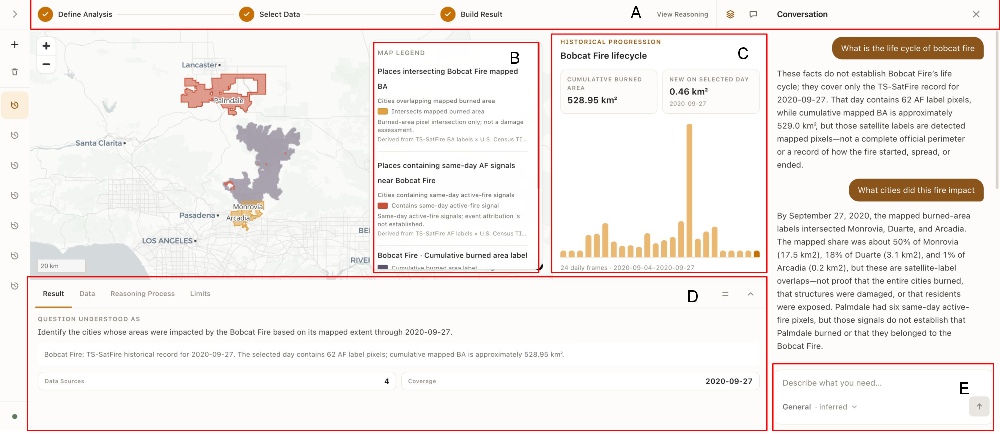

# FireScope

A multi-agent geospatial system that **defines the question before it answers it**.

## How to run

**No API key needed to start.** `LLM_PROVIDER=mock` drives the same pipeline with
keyword rules, and the UI badges it so a stub never passes for real inference. It
covers a session's first turn only — any follow-up that resolves *"it"* or *"those
places"* raises rather than guessing, so demonstrating the conversational chain
needs a configured provider.

```bash
# Backend
cd backend && uv sync --extra anthropic --extra openai
cp ../.env.example ../.env
LLM_PROVIDER=mock uv run uvicorn wildfire_agent.api:app --reload

# Frontend, second terminal
cd frontend && pnpm install
cp .env.local.example .env.local
pnpm dev                                    # → http://localhost:3000
```

For a real model, set `LLM_PROVIDER` and `LLM_MODEL` in `.env` — `anthropic`,
`openai`, `azure_openai`, `google_genai`, `groq` and `ollama` all work, with no
code changes. There is a CLI too:

```bash
uv run wildfire -q "Which areas burned in the Eaton Fire around Altadena?"
```

## Download the dataset

**The historical fire analyses need a separate archive.** Burn severity, NDVI
change, land cover, spread behaviour and fire weather all read a ~1.9 GB
TS-SatFire subset that is not in this repository. Download it from
[this folder](https://drive.google.com/drive/folders/14AgkvlPX2Mae20yv7Gm9NvKPnQEJnx4w),
place `full_data/` outside the checkout, and set `LOCAL_DATA_ROOT` to its parent
directory.

Without it the app runs and the catalogue is simply empty — no error, so it looks
like nothing matched. See [`backend/data/README.md`](backend/data/README.md).

## Case study

A single session over the Bobcat Fire (Angeles National Forest, Los Angeles
County, September 2020). The opening request, *"What is the life cycle of bobcat
fire"*, names an event and nothing else. The agent matches it in the local
TS-SatFire archive and loads the twenty-four daily frames covering 2020-09-04 to
2020-09-27. FireScope draws the active-fire labels over the accumulated burned area, and
the analysis panel presents an interactive lifecycle bar plot so the severity of
each day in the series can be inspected. The answer in the conversation covers
the TS-SatFire record and nothing beyond it: 62 active-fire label pixels on
2020-09-27, against approximately 529.0 km² of cumulative mapped burned area.



> **(A)** workflow and view controls · **(B)** source-aware map legend ·
> **(C)** lifecycle panel · **(D)** information panel with Result, Data,
> Reasoning and Limits · **(E)** composer with inferred query scope.
> The conversation appears at right.

From here the session can continue in either of two directions. The first is to
ask about the layers already on the map — what BA means, or how NDVI differs
before and after the fire. The second is to ask for information that concerns the
fire but is not carried by those layers. The screenshot follows the second: we
asked *"What cities did this fire impact"*. The agent joins the accumulated
burned-area pixels to Census place boundaries, returns the places that overlap
the footprint, and reports the share of each place that falls inside it. Monrovia,
Duarte and Arcadia intersect the footprint. Palmdale is reported separately and
under a caveat, because its six same-day active-fire pixels do not establish that
the city burned, or that those detections belonged to this fire. The agent then
asks for permission before connecting to an external source, the Census Bureau's
American Community Survey, which supplies the population and housing attributes
that no local layer carries.

The panels beneath the map carry the evidence for the answer. **Result** states
how the agent understood the request as a single question, and the answer it
returned for that question. **Data** lists every source involved in the session
together with its metadata. **Reasoning** presents the steps taken: interpreting
the request, resolving scope, selecting evidence, performing the spatial
analysis, and building the result. **Limits** records the assumptions and caveats
the session rests on.
